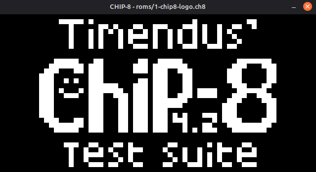
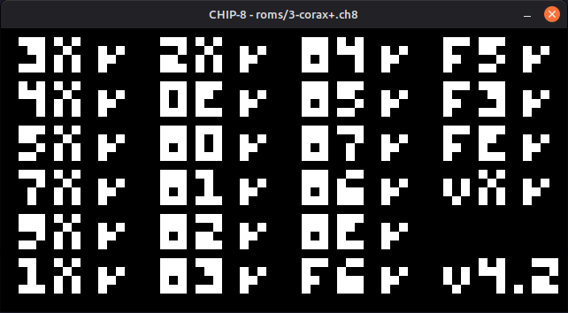

# CHIP-8 Emulator

A modular CHIP-8 interpreter written in Rust.

This project explores emulator architecture through a clean separation of hardware components, instruction decoding, and execution.

Rather than pursuing maximum performance, the implementation emphasizes readability, maintainability, strong typing, and explicit design decisions while remaining compatible with common CHIP-8 software.


---

## Table of Contents

- [Highlights](#highlights)
- [Screenshots](#screenshots)
- [Motivation](#motivation)
- [Technologies](#technologies)
- [Architecture](#architecture)
- [Project Structure](#project-structure)
- [Building](#building)
- [Controls](#controls)
- [Compatibility](#compatibility)
- [Design Goals](#design-goals)
- [Repository History](#repository-history)
- [Scope](#scope)
- [Acknowledgements](#acknowledgements)
- [License](#license)

---

## Highlights

- Modular hardware component design
- Fetch → Decode → Execute execution pipeline
- Semantic instruction representation
- Strongly typed registers and keypad
- Documented architecture and compatibility decisions
- Successfully validated against common CHIP-8 test ROMs

---

## Screenshots

<p align="center">
  
</p>

<p align="center">
  <em>Timendus CHIP-8 Test Suite</em>
</p>

<br>

<p align="center">
  
</p>

<p align="center">
  <em>Corax Opcode Test</em>
</p>

---

## Motivation

This project began as one of my earlier Rust experiments and was later revisited with the goal of turning it into a polished, maintainable codebase.

Rather than simply making the emulator "work", I wanted to explore how to organize a moderately sized systems project with clear module boundaries, strong typing, and explicit control flow.

The result is an emulator that serves both as a functional CHIP-8 interpreter and as a demonstration of software engineering practices in Rust.

---

## Technologies

- Rust
- SDL2

---

## Architecture

```
              Frontend (SDL2)
                    │
        Input ──────┼────── Render
                    │
                CPU Cycle
                    │
      Fetch → Decode → Execute
                    │
    ┌────────┬────────┬────────┬────────┐
    │        │        │        │        │
 Memory  Registers  Display  Keyboard Timers
```

The emulator intentionally separates opcode decoding from execution.

Instead of interpreting raw opcodes directly, every opcode is first decoded into a semantic `Instruction`, allowing the executor to focus solely on implementing CHIP-8 behavior.

---

## Project Structure

```text
src
├── assets
│   └── Built-in CHIP-8 font
│
├── components
│   ├── mod.rs
│   ├── display.rs
│   ├── keyboard.rs
│   ├── memory.rs
│   └── register.rs
│
├── cpu
│   ├── decoder.rs
│   ├── executor.rs
│   ├── instruction.rs
│   └── mod.rs
│
├── frontend
│   └── sdl.rs
│
└── main.rs
```

---

## Building

```bash
cargo build --release
```

Run a ROM

```bash
cargo run -- roms/2-ibm-logo.ch8
```

---

## Controls

```
Keyboard          CHIP-8

1 2 3 4      ->   1 2 3 C
Q W E R      ->   4 5 6 D
A S D F      ->   7 8 9 E
Z X C V      ->   A 0 B F
```

Press **Esc** to quit.

---

## Compatibility

Validated using

- IBM Logo
- Timendus CHIP-8 Test Suite
- Corax Opcode Test

See [QUIRKS.md](docs/QUIRKS.md) for supported compatibility behavior.

---

## Design Goals

This project intentionally favors:

- Readability
- Small focused modules
- Strong typing
- Minimal abstractions
- Explicit control flow

over premature optimization.

---

## Repository History

The project originated as a collection of local experiments and was later extensively refactored into its current architecture before being published.

As a result, the public repository reflects the final refined implementation rather than the project's earliest development history..

---

## Scope

The current implementation targets the original CHIP-8 specification.

Behavioral compatibility decisions are documented in `docs/QUIRKS.md`.

---

## Acknowledgements

Thanks to the CHIP-8 community for preserving documentation, test ROMs, and compatibility resources that made this project possible.

Special thanks to the authors of the Timendus and Corax test suites for providing comprehensive validation tools.

---

## License

MIT